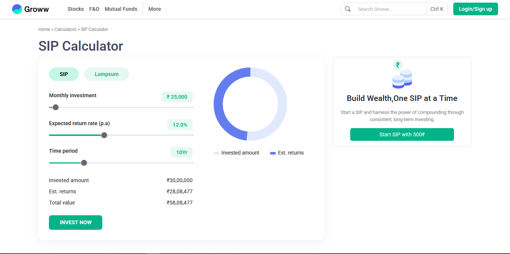

# SIP Calculator

A simple, interactive SIP (Systematic Investment Plan) calculator web app built with HTML, CSS, JavaScript, and Bootstrap. The calculator helps users estimate the future value of their monthly investments, expected returns, and total value over a selected period, visualized with a dynamic donut chart.

#Deploy link

https://pr-1-conditional-statments-js.vercel.app/

# Screenshot

## Features

- **Live Calculation:** Adjust monthly investment, expected return rate, and time period using sliders to see real-time updates.
- **Dynamic Chart:** Visual donut chart (using Chart.js) displays the split between invested amount and estimated returns.
- **Responsive UI:** Clean, modern interface styled with Bootstrap and custom CSS.
- **Quick Actions:** "Invest Now" and "Start SIP with ₹500" buttons for user engagement.

## How to Use

1. Clone or download this repository.
2. Open `index.html` in your browser.
3. Use the sliders to set:
   - Monthly investment amount
   - Expected annual return rate
   - Investment time period (years)
4. View the calculated invested amount, estimated returns, and total value.
5. The donut chart updates automatically as you change the values.
